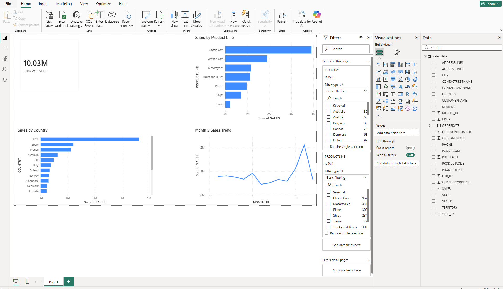

# Power BI Sales Dashboard

## Overview
This project analyzes sales performance using an interactive Power BI dashboard.

## Dashboard Features
- Total revenue KPI
- Monthly sales trends
- Top-selling products
- Country-wise sales analysis
- Interactive filtering and visuals

## Tools Used
- Power BI
- Data Visualization
- Business Intelligence
- Data Analytics

## Files
- `sales_dashboard.pbix` - Power BI dashboard file
- `dashboard_screenshots/` - Dashboard screenshots
- `sales_data.csv` - Dataset used

## Key Insights
- Identified top-performing product lines
- Analyzed monthly sales trends
- Compared revenue across countries
- Built interactive filtering using slicers
- Created KPI-based business dashboard

## Dashboard Preview



## How to Run

1. Open Power BI Desktop

2. Open:

```txt
sales_dashboard.pbix
```

3. Interact with filters and visuals to explore sales insights
